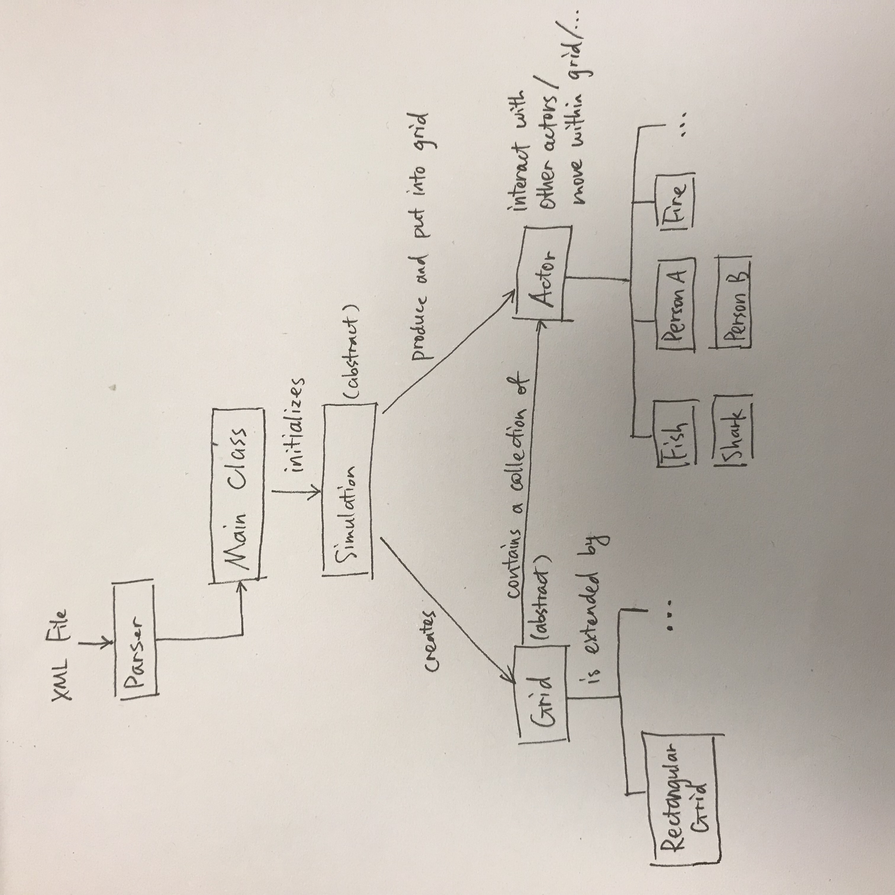

# Cell Society Plan

#### Introduction

This program is designed to handle multiple types of Cellular Automata simulations. The design goals of this project are to maintain enough flexibility to easily extend our program to handle future requirements as well as alternative simulations. Inputs such as threshold values, size, and simulation type will be open to the user to adjust. Implementation of cell interactions will be closed. Cells will be displayed in a grid and will determine their state periodically based on the simulation rules. These changes in state will then be reflected in the UI. In addition to the open values mentioned before, users will be able to start, stop, reset and step the through the simulation, as well as speed up and slow down the simulation.

#### Overview

We are dividing the program up into the following components:

##### Actor Class(abstract parent class) Common across all simulations
This class creates objects that appear within the grid and move around the grid. This class will be extended to create actors that move according to rules for a specific simulation. 
* Instance Variables:
    * Location
    * List of Neighbor Locations
    * Grid they belong to
    * Future State
    * View
* Methods:
    * constructor
    * removeFromGrid(); --> die
    * addToGrid(); --> be born
    * move(location);
    * getNeighbors();
    * getLocation();
    * updateNeighborLocations();
    * getNeighbors(grid) --> iterate through locations and call grid.getActor(location)
    * determineFutureState(); --> abstract
    * abstract method act();
    * draw() returns a rectangle

##### Grid Class (Abstract)
The grid class creates a grid which tells the actor the  possible locations for it to move along. The grid also allows for the neighbors to be found. It is abstract to allow for different types of grids (e.g. 2D rectangular grid). 
* Public Static Final Variables:
    * GRID_SIZE
    * GRID_X_LOCATION
    * GRID_Y_LOCATION
* Instance
    * Collection of Actors
    * View
* Methods
    * Constructor
        * Will take in the information inputted from the UI or XML file
    * getActor(location)
    * updateActors() will iterate through all actors and call them to act
    * addActor(location, Actor)
        * the implementation of this will depend on what data structure the grid is implemented as. For example, a RectangularGrid will implement a double array as the collection of Actors and will therefore addActor by adding the actor to the given location in the double array.
    * removeActor(location, Actor)
    * getEmptyLocations();
    * draw() draws grid lines

##### Simulation Abstract Class
This class creates a simulation. The scene is created and the actors and grid are added to it. This step also includes the animation for the simulation. 
* Constants
    * Size of simulation space
* Instance Variables
    * Grid
    * Scene
    * State --> Started or Paused/On or Off
    * Root
* Methods
    * createGrid()
    * fillGrid() --> will be abstract
    * update() --> will call the step function and be called by the scene at the set interval as long as the program isn't in pause or currently being stepped through.
    * step();
    * stop();
    * end();
    * pause();
    * getGroup() -> will return a group of all of the views of actors held in the grid.
    * handleUIButtons();

##### Main Class
Combines all of the previous classes and reads in the config file and other user inputs. 
* Instance Variables:
    * Simulation
* Methods:
    * parseXML()
    * Main method -> Launch the simulation
    * handleButtonInput() -->  start/stop/pause/step buttons and user value inputs
        * Upon a reset or loading of new XML file, we create a new simulation
        * Load, and Start will be handled in main.

#### User Interface

The user interface will consist of five buttons: start, stop, step, faster, and slower. The "faster" and "slower" buttons are used before the simulation has started (potentially after the configuration file has been loaded) to set the animation speed. Next to these two buttons, the value of the time delay during the simulation between steps will be displayed. This time delay value will decrease when "faster" is pushed and increase when "slower" is pushed. These buttons will be placed below the scene with the grid where the simulation is taking place. 

In addition, there will be a text box where the user will input a file name containing the XML configuration file. Next to this textbox will be a load button. The load button will stop the current simulation and start a new simulation based on the new file name. This button and textbox will be placed above the scene.

If the file name is empty or does not exist, then an error message will be displayed.

#### Design Details 

* Actor Class (Abstract)
    * We plan on extending this class to create specific actors that will implement the act method in order to determine its future state based on its neighbors. Some examples of these subclasses are Fish, Shark, Fire, Tree, Person Type A and Person Type B. These classes will have instance variables specific to the type of actor and the simulation they are relevant for. For example, a Fish actor will have an additional breedingTime variable, as well as methods to procreate. Actors will use the neighboring actors to determine its future state.
    * Actors will be held in a grid, which will be implemented by a Grid class. 

* Grid Class (Abstract)
    * The grid class will be extended depending on the shape of the grid. For example, we will implement a RectangularGrid class that will extend this. This allows for greater flexibility in the future. 
    * The grid will be created, filled, and displayed by the Simulation Class.

* Simulation Class (Abstract)
    * This Simulation class will be extended by specific simulations, such as a WatorWorldSimulation class that will have a createFish() and createShark() functions and will fill its grid with sharks and fish as opposed to the SchellingsSimulation, which will fill its grid with PersonA and PersonB. Our Simulation classes will be instansiated and started in our main class.

#### Design Considerations 

Issues Left to Resolve:
* Exact translation of actor specific views to a GUI
    * how to express empty cells etc.
* Determine if simulation speed must change mid simulation or can only be set before a simulation starts.
    * if this must happen mid simulation, we need to look into changing the step delay for a JavaFx scene.
* Implementation of specific rules for each actor type
* How much UI button handling logic will be in main and how much will be in our simulation classes.

Design Discussions:
* When first designing this project we had planned on using cell classes that would have a particular state. Depending on that state the rules of how that cell behaved would change. However, we realized this design was not conducive with the need to empty and move the content of cells. At that point we transitioned into considering a Cell class with an Actor instance variable. However, we realized that the Cell class would only hold the location and neighbors in addition to the Actor. Instead of having this extraneous class that would not actually contain any independent logic, we decided to move towards a Super Actor class that would keep track of its own location and neighbor location. 
    * We also discussed holding an instance variable of a list of neighbor actors versus a list of neighbor locations. Since actors can frequently move, we decided to implement a list of neighbor locations (since those locations would stay the same for an actor until it moved independent of its neighbors actions) and a getActor method in our grid that would retrieve the actors currently at those locations. 

* We had originally planned on implementing a specific type of grid for each type of simulation that would extend our grid class. However, we realized that the grid needed would actually always be the same, the differences between the simulations really depended on how that grid was filled. We then changed this relationship from the simulation extending Grid to having the simulation create and use a grid. We also decided to createa a more general grid interface that would allow us to implement grids that potentially needed to be backed by something other than a 2D array. We then decided to extend that Grid interface with a RectangularGridFunction that would use a 2D array. The design decision here was the difference of having to redo our implementation for all the simulations if we needed to change the way our cell neighbors were calculated (for instance if the cells became triangles and a 2D array was no longer the best way to hold and determine neighbor relationships of actors).

#### Team Responsibilities

Initial Responsibilities:
Marley --> Abstract Actor class and Game of Life Actor class
Russell --> Abstract Grid class and Rectangular Grid class
Qingyang --> Abstract Simulation class and Game of Life Simulation class

By Tuesday: Run a simulation of Game of Life with hardcoded inputs, no XML file, no UI interaction, but show the graphic. 

Final Responsibilities: 
Marley --> Remaining Actor classes/Additional interactions with grid
Russell --> XML File, outside of scene GUI
Qingyang --> Remaining Simulation classes

